<h1>Blogs API</h1>

  Blogs API is a CRUD API. It is built using Node.js, Express.js and MySQL with Sequelize ORM. MSC architecture (Models, Services, 
  Controllers) was applied in this project.
  
  The project was developed in a docker environment.

  The user is able to: 
  - Create, read, update and delete posts;
  - Create and read categories;
  - Create, read, delete and login users

<h2> Built With </h2>

 
 - NodeJS 

 
- Express 

 
 - MySQL 

 
 - Docker 
 
 
 - JWT 

 
 - Conventional commits (extension) 

<h2>Endpoints</h2>

<h3> Login: </h3>

<h3> - POST  </h3>
 
<strong> /login </strong>

 Log in 

<strong> Parameters:</strong> 
 

- body
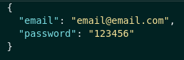

<strong> Response: </strong>

 Status: 200 

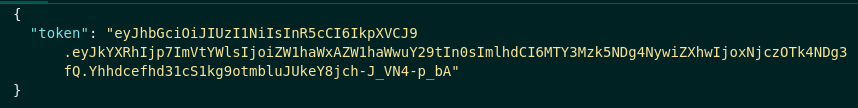

 Status: 400 

- Some required fields are missing

- Invalid fields

 
 

<h3> User: </h3>

<h3> - POST  </h3>
 
<strong> /user </strong>

 Create user 

<strong> Parameters:</strong> 
 

- body
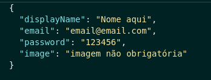

<strong> Response: </strong>

 Status: 201 

 Status: 400 

- DisplayName length must be at least 8 characters long

- Email must be a valid email

- Password length must be at least 6 characters long

 Status: 409 

 - User already registered

 

<h3> - GET  </h3>
 
<strong> /user </strong>

 Get all users 

<strong> Parameters:</strong> 
 

- headers

 authorization: "eyJhbGciOiJIUz...." (token) 
 

<strong> Response: </strong>

 Status: 200 

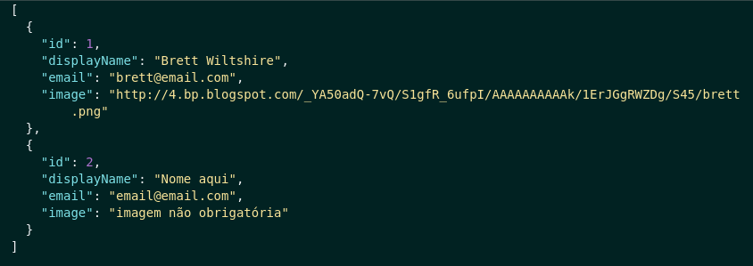

 Status: 401 

- Token not found 

- Expired or invalid token 

 

<strong> /user/:id </strong>

 Get user by id 

<strong> Parameters:</strong> 
 

- headers

 authorization: "eyJhbGciOiJIUz...." (token) 
 

<strong> Response: </strong>

 Status: 200 

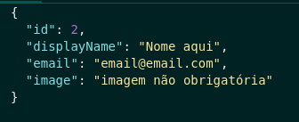

 Status: 401 

- Token not found 

- Expired or invalid token 

 Status: 404 

- User does not exist 

 

<h3> - DELETE  </h3>
 
<strong> /user/me </strong>

 Delete your user 

<strong> Parameters:</strong> 
 

- headers

 authorization: "eyJhbGciOiJIUz...." (token) 
 

<strong> Response: </strong>

 Status: 204 

 Status: 401 

- Token not found 

- Expired or invalid token 

 

<h3> Categories: </h3>

<h3> - POST  </h3>
 
<strong> /categories </strong>

 Create categories 

<strong> Parameters:</strong> 
 

- body
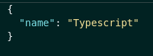

<strong> Response: </strong>

 Status: 201 

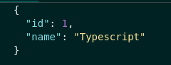

 Status: 400 

- Name is required 

 

<h3> - GET  </h3>
 
<strong> /categories </strong>

 Get all categories 

<strong> Parameters:</strong> 
 

- headers

 authorization: "eyJhbGciOiJIUz...." (token) 
 

<strong> Response: </strong>

 Status: 200 

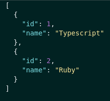

 Status: 401 

- Token not found 

- Expired or invalid token 

 

<h3> Post: </h3>

<h3> - POST  </h3>
 
<strong> /post </strong>

 Create post 

<strong> Parameters:</strong> 
 

- body
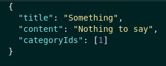

<strong> Response: </strong>

 Status: 201 

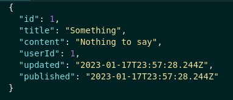

 Status: 400 

- Some required fields are missing

- one or more categoryIds not found 

 

<h3> - GET  </h3>
 
<strong> /post </strong>

 Get all posts 

<strong> Parameters:</strong> 
 

- headers

 authorization: "eyJhbGciOiJIUz...." (token) 
 

<strong> Response: </strong>

 Status: 200 

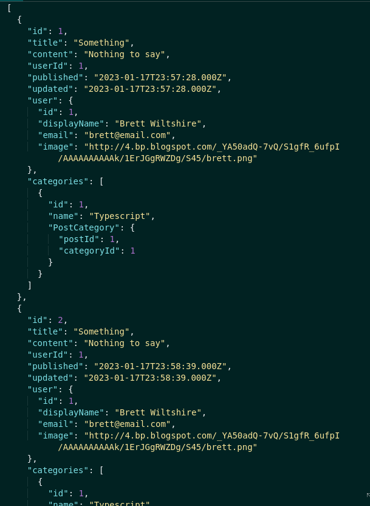

 Status: 401 

- Token not found 

- Expired or invalid token 

 

<strong> /post/:id </strong>

 Get post by id 

<strong> Parameters:</strong> 
 

- headers

 authorization: "eyJhbGciOiJIUz...." (token) 
 

<strong> Response: </strong>

 Status: 200 

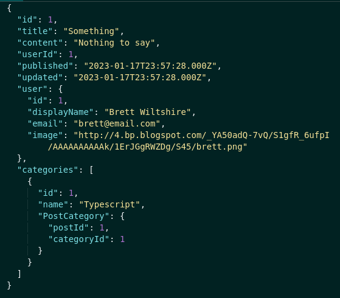

 Status: 401 

- Token not found 

- Expired or invalid token 

 Status: 404 

- Post does not exist 

 

<strong> /post/search?q="term" </strong>

 Get post by search term 

<strong> Parameters:</strong> 
 

- headers

 authorization: "eyJhbGciOiJIUz...." (token) 
 

<strong> Response: </strong>

 Status: 200 

- [] (inexistente)

 Status: 401 

- Token not found 

- Expired or invalid token 

 

<h3> - UPDATE  </h3>

<strong> /post/:id </strong>

 Update a post by id 

<strong> Parameters:</strong> 
 

- headers

 authorization: "eyJhbGciOiJIUz...." (token) 

- body
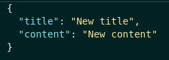

<strong> Response: </strong>

 Status: 200 

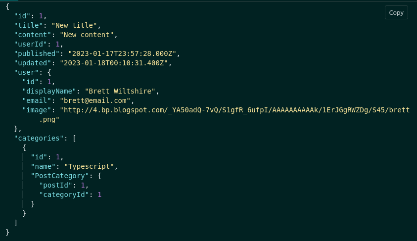

 Status: 400 

- Some required fields are missing

 Status: 401 

- Token not found 

- Expired or invalid token 

 - Unauthorized user 

 

<h3> - DELETE  </h3>
 
<strong> /post/:id </strong>

 Delete post by id 

<strong> Parameters:</strong> 
 

- headers

 authorization: "eyJhbGciOiJIUz...." (token) 
 

<strong> Response: </strong>

 Status: 204 

 Status: 401 

- Token not found 

- Expired or invalid token 

 - Unauthorized user 

 Status: 404 

- Post does not exist 

 

<h2>
  How try the application?
</h2>

  Using docker (version 1.29 > is required):   
   1. First run in your terminal <code>docker-compose up -d</code> to up containers.  
   2. Then use the command <code>docker exec -it blogs_api bash</code> to acess the container terminal.  
   3. After it use  <code>npm install</code> to install all dependences.  
   4. Run <code>npx sequelize-cli db:create && npx sequelize-cli db:migrate</code> on container terminal to create db and tables. 
   5. Run <code>npm run seed</code> on container terminal to populate the db. 
   6. Run <code>npm start</code> on container terminal to start the application. 
   7. If you don´t have any client extension to do the requestions download <code>Thunder Client</code> extension on VS Code. 
   8. Select the method on thunder client. 
   9. Do requisitions on thunder client using the URL shape http://localhost:3000/endpoint.

  Make sure that all containers are up and the ports 3000, 3006 and 33060 of your computer are available

 
  

 Any questions or suggestions? Contact me 

